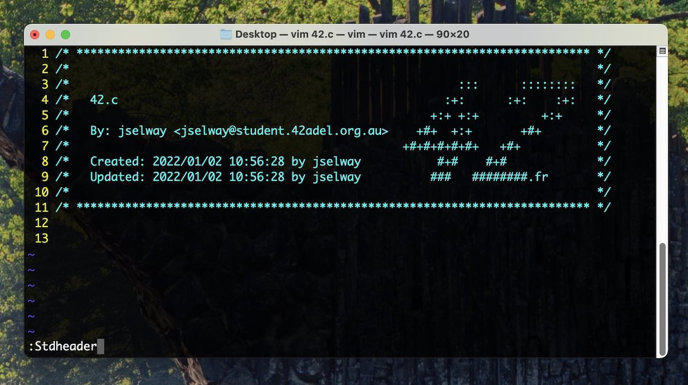

# **42 Header**

42 (Adelaide)

### **Description**

42 standard header for vim editor with modified setup script to:
- Accept argument for 42 username (*e.g.: `./set_header.sh jselway`*)
- Interactively prompt for 42 username with no argument
- Set .vimrc for home use
- Detect bash or zsh for setting shell environment variables
- Use @student.42adel.org.au email format.



### **UNIX (macOS, Linux, BSD (untested)) Quick Setup**

- [Download .zip of this repository](https://github.com/joeselway/42header/archive/refs/heads/master.zip)
- Extract and `cd` to extracted directory
- Run `./set_header.sh` followed by your 42 username, e.g. `./set_header.sh jselway`, or enter your 42 username when prompted!

### **UNIX Manual Setup (*set_header.sh method above recommended!*)**

Copy `stdheader.vim` in your `~/.vim/plugin`, or use your favorite plugin
manager. Then set the user and mail variables as explained below.

#### Option 1: export USER and MAIL in your shell configuration file

Add in `~/.zshrc` your:

+ `USER`
+ `MAIL`

#### Option 2: set user and mail values directly in your vimrc

```vim
let g:user42 = 'yourLogin'
let g:mail42 = 'yourLogin@student.42adel.org.au'
```

### **Usage**

In **NORMAL** mode you can use `:Stdheader` or simply press the shortcut <kbd>F1</kbd>.

Under **Linux** you eventually need to disable the **help** shortcut of your **terminal** :

For **Terminator**, right click -> Preferences -> Shortcuts -> change help with something other than <kbd>F1</kbd>

### **Credits**

[@zazard](https://github.com/zazard) - creator  
[@alexandregv](https://github.com/alexandregv) - contributor  
[@mjacq42](https://github.com/mjacq42) - contributor  
[@sungmcho](https://github.com/lordtomi0325) - contributor  

### **License**

This work is published under the terms of **[42 Unlicense](https://github.com/gcamerli/42unlicense)**.
